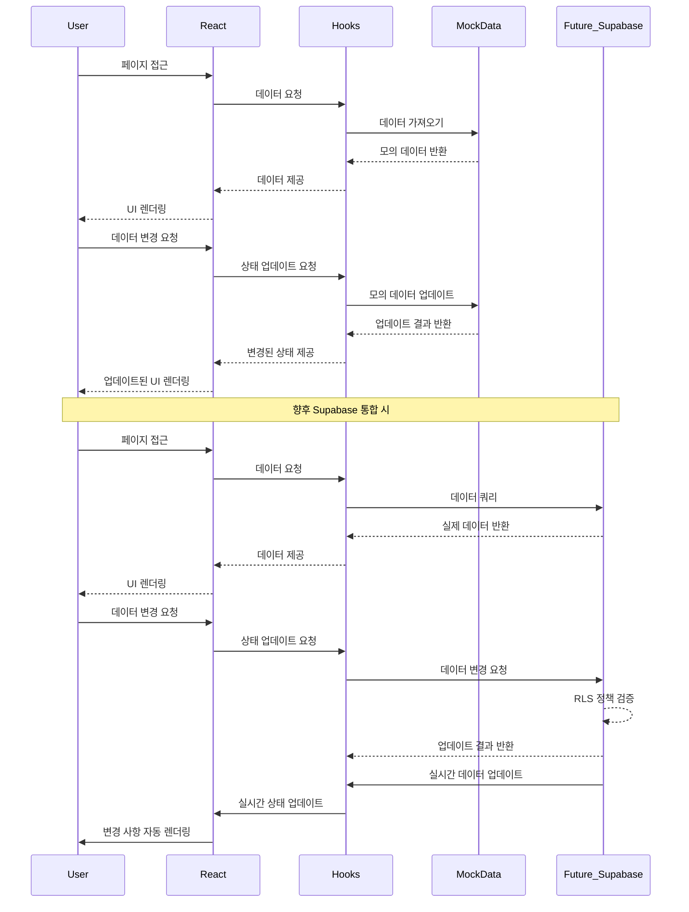

# 무쏘(Musso) 프로젝트 컴포넌트 관계도

## 페이지와 컴포넌트 관계도

```mermaid
graph TB
    subgraph 메인_라우팅
        App[App.tsx]
        Layout[Layout.tsx]
        AppSidebar[AppSidebar.tsx]
    end

    subgraph 페이지_컴포넌트
        Dashboard[Dashboard.tsx]
        Finance[Finance.tsx]
        AnnouncementManagement[AnnouncementManagement.tsx]
        FinanceManagement[FinanceManagement.tsx]
        MatchManagement[MatchManagement.tsx]
        PlayerStats[PlayerStats.tsx]
        MyStats[MyStats.tsx]
        Login[Login.tsx]
    end

    subgraph 대시보드_컴포넌트
        AnnouncementsCard[AnnouncementsCard.tsx]
        UpcomingMatchesCardWrapper[UpcomingMatchesCardWrapper.tsx]
        CalendarView[CalendarView.tsx]
        MvpVotingCard[MvpVotingCard.tsx]
    end

    subgraph 재정_컴포넌트
        FinanceSummaryCards[FinanceSummaryCards.tsx]
        TransactionTable[TransactionTable.tsx]
        MemberDuesTable[MemberDuesTable.tsx]
        FinanceSummary[FinanceSummary.tsx]
        TransactionsTab[TransactionsTab.tsx]
        DuesManagementTab[DuesManagementTab.tsx]
    end

    %% 앱 구조 연결
    App --> Layout
    Layout --> AppSidebar
    
    %% 라우팅 연결
    Layout --> Dashboard
    Layout --> Finance
    Layout --> AnnouncementManagement
    Layout --> FinanceManagement
    Layout --> MatchManagement
    Layout --> PlayerStats
    Layout --> MyStats
    Layout --> Login
    
    %% 대시보드 페이지 컴포넌트 연결
    Dashboard --> AnnouncementsCard
    Dashboard --> UpcomingMatchesCardWrapper
    Dashboard --> CalendarView
    Dashboard --> MvpVotingCard
    
    %% 재정 페이지 컴포넌트 연결
    Finance --> FinanceSummary
    Finance --> TransactionTable
    Finance --> MemberDuesTable
    
    %% 재정 관리 페이지 컴포넌트 연결
    FinanceManagement --> FinanceSummaryCards
    FinanceManagement --> TransactionsTab
    FinanceManagement --> DuesManagementTab
```

## 컴포넌트별 역할

### 공통 컴포넌트
- **Layout.tsx**: 모든 페이지의 레이아웃을 제공하는 컴포넌트
- **AppSidebar.tsx**: 애플리케이션 네비게이션 사이드바 컴포넌트

### 대시보드 페이지 (Dashboard.tsx)
- **AnnouncementsCard.tsx**: 공지사항 목록 표시
- **UpcomingMatchesCardWrapper.tsx**: 다가오는 경기 정보 표시 
- **CalendarView.tsx**: 월별 캘린더에 이벤트 표시
- **MvpVotingCard.tsx**: 당일 경기 MVP 투표 컴포넌트

### 재정 페이지 (Finance.tsx)
- **FinanceSummary.tsx**: 재정 상태 요약 정보 표시
- **TransactionTable.tsx**: 거래 내역을 표로 표시
- **MemberDuesTable.tsx**: 회원 회비 납부 상태 표시

### 재정 관리 페이지 (FinanceManagement.tsx)
- **FinanceSummaryCards.tsx**: 재정 상태 요약 카드 모음
- **TransactionsTab.tsx**: 거래 내역 관리 탭
- **DuesManagementTab.tsx**: 회비 관리 탭

## 데이터 흐름도

## 페이지와 컴포넌트 인터랙션

### 대시보드 페이지 인터랙션
1. 사용자는 새로운 공지사항을 볼 수 있음
2. 사용자는 다가오는 경기에 참석 여부를 표시할 수 있음
3. 사용자는 달력 뷰에서 전체 일정을 확인할 수 있음
4. 당일 경기가 있으면 MVP 투표 카드가 표시됨

### 재정 페이지 인터랙션
1. 사용자는 전체 재정 요약을 확인할 수 있음
2. 사용자는 거래 내역을 페이지네이션으로 볼 수 있음
3. 사용자는 회비 납부 상태를 확인할 수 있음
4. 권한이 있는 관리자는 회비 납부 상태를 토글할 수 있음

### 재정 관리 페이지 인터랙션
1. 관리자는 새로운 거래 내역을 추가할 수 있음
2. 관리자는 기존 거래 내역을 수정하거나 삭제할 수 있음
3. 관리자는 회비 정보를 추가하거나 수정할 수 있음

## 데이터 상태 관리

현재 프로젝트는 React의 내장 상태 관리를 사용하여 각 커스텀 훅(useAnnouncements, useFinanceData 등)에서 상태를 관리하고 있습니다. 향후 확장성을 위해 다음 사항을 고려할 수 있습니다:

1. **React Query 또는 SWR 도입**
   - 서버 상태 관리와 캐싱을 위한 라이브러리 도입
   - 자동 재시도 및 백그라운드 업데이트 활용

2. **Context API 또는 Redux 도입**
   - 전역 상태 관리가 필요한 경우 고려
   - 복잡한 상태 로직을 중앙화하여 관리

3. **Supabase 실시간 구독 통합**
   - 실시간 업데이트가 필요한 기능에 Supabase의 실시간 기능 활용
   - 중복 쿼리 최소화 및 데이터 동기화 전략 수립 