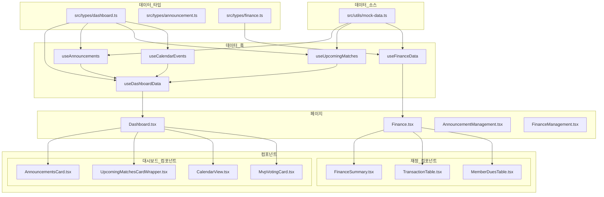

# 무쏘(Musso) 프로젝트 데이터 흐름 시각화

## 데이터 구조 및 흐름



## 컴포넌트별 데이터 출력 방식

### 대시보드 페이지
- **AnnouncementsCard**: 공지사항(Announcement[]) 목록을 표시
- **UpcomingMatchesCardWrapper**: 다가오는 경기(UpcomingMatch[]) 정보 표시
- **CalendarView**: 월별 캘린더에 이벤트(CalendarEvent[]) 표시
- **MvpVotingCard**: 당일 경기 후 MVP 투표를 위한 컴포넌트

### 재정 페이지
- **FinanceSummary**: 재정 총 잔액, 수입/지출 요약 표시
- **TransactionTable**: 거래 내역(Transaction[]) 테이블로 표시
- **MemberDuesTable**: 회원 회비 납부 상태(MemberDues[]) 표시

## 데이터 타입 구조

### Dashboard 관련 타입 (src/types/dashboard.ts)
```typescript
interface Player { id: string; name: string; }

interface Announcement {
  id: number;
  title: string;
  type: 'notice' | 'match';
  date: string;
  content: string;
  author: string;
  updatedAt?: string;
}

interface UpcomingMatch {
  id: number;
  date: string;
  location: string;
  opponent?: string;
  attending?: number;
  notAttending?: number;
  pending?: number;
  status?: 'scheduled' | 'cancelled';
  attendingPlayers?: Player[];
  notAttendingPlayers?: Player[];
  pendingPlayers?: Player[];
}

interface CalendarEvent {
  type: 'match' | 'notice';
  title: string;
  status?: 'scheduled' | 'cancelled';
}

interface DashboardData {
  announcements: Announcement[];
  upcomingMatches: UpcomingMatch[];
  calendarEvents: Record<string, CalendarEvent[]>;
}
```

### Finance 관련 타입 (src/types/finance.ts)
```typescript
interface Transaction {
  id: number;
  date: string;
  description: string;
  amount: number;
  type: 'income' | 'expense';
  category: string;
  member?: string;
}

interface MemberDues {
  id: number;
  name: string;
  paid: boolean;
  dueDate: string;
  amount: number;
  paidDate?: string;
  paidAmount?: number;
}
```

### Announcement 관련 타입 (src/types/announcement.ts)
```typescript
interface Announcement {
  id: number;
  title: string;
  type: 'notice' | 'match';
  content: string;
  date: string;
  author: string;
  location?: string;
  opponent?: string;
  matchTime?: string;
  attendanceTracking?: boolean;
}

interface AnnouncementFormData extends Partial<Announcement> {}
```

## 데이터 흐름 과정

1. 현재는 모든 데이터가 `src/utils/mock-data.ts`에서 정적으로 생성됨
2. 각 데이터 타입에 맞는 커스텀 훅(`useAnnouncements`, `useUpcomingMatches`, `useFinanceData` 등)에서 데이터를 가져옴
3. 페이지 컴포넌트에서 필요한 훅을 호출하여 데이터를 가져옴
4. 페이지 컴포넌트는 데이터를 하위 컴포넌트에 props로 전달하여 렌더링

## 향후 Supabase 통합 방안

현재 모든 데이터는 모의 데이터를 사용하고 있으며, 실제 Supabase 통합 시 아래와 같은 변경이 필요합니다:

1. 각 훅에서 `getMockData()` 호출을 Supabase 쿼리로 대체
2. 데이터 변경 함수(예: `togglePaymentStatus`)를 Supabase 업데이트 쿼리로 구현
3. 실시간 업데이트가 필요한 경우 Supabase의 실시간 구독 기능 활용 